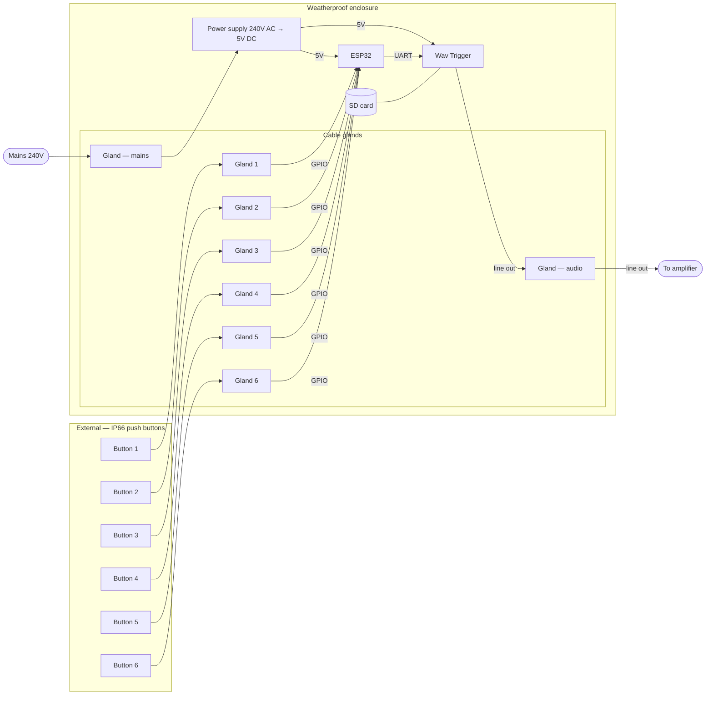

# abimaro_southbank

## Audio File Preparation

WAV files exported from Logic Pro (and some other DAWs) contain metadata chunks that can cause issues with the Wav Trigger. Use this ffmpeg command to strip metadata and ensure clean 16-bit, 44.1kHz stereo WAV files:
```bash
# Convert and strip metadata from all WAV files in current directory
mkdir -p fixed
for file in *.wav; do
  ffmpeg -i "$file" -acodec pcm_s16le -ar 44100 -ac 2 -map_metadata -1 "fixed/$file"
done
```

**Required format for Wav Trigger:**
- 16-bit PCM
- 44.1kHz sample rate
- Stereo (2 channels)
- No metadata chunks
- Files must be named: `001.wav`, `002.wav`, `003.wav`, etc.

**Checking file format:**
```bash
soxi filename.wav
```
